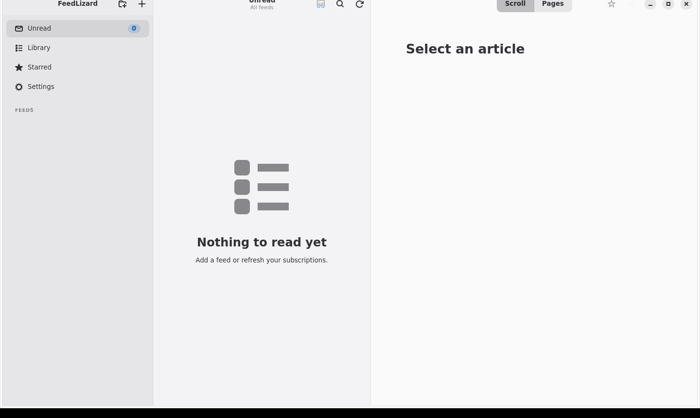

# FeedLizard

FeedLizard is a native, local-first RSS reader for Linux built with Rust,
GTK4, libadwaita, and SQLite. It requires no account, has no telemetry, and
keeps subscriptions and reading state on the user's computer. This source tree
is intentionally independent of the commercial Apple application.

Optional desktop-shell integrations consume the narrow D-Bus contract in
[`docs/DESKTOP_INTEGRATION.md`](docs/DESKTOP_INTEGRATION.md). The official
Omarchy plugin source lives at [`integrations/omarchy`](integrations/omarchy);
it is never installed or enabled silently and is not required on other
distributions.

> **Release candidate:** FeedLizard Linux is approaching its 1.0 release.
> Please report behavior that does not work as expected before the stable
> release.

The graphical application is a 1.0 release-candidate work in progress. Its adaptive
three-pane interface, feed management, refresh, offline search, bounded image
pipeline, release-bundled feed discovery, Scroll reader, and native Pages
prototype are implemented. Human
usability, accessibility, and release review are still required
before production use. Fedora aarch64 is the current native development and
runtime-validation platform. The source and CI target both aarch64 and x86-64;
x86-64 desktop runtime validation remains required before Linux 1.0.



## Optional encrypted Nostr backup

FeedLizard can manually back up subscriptions, folders, and custom feed names
as an encrypted, OPML-compatible snapshot. Local SQLite remains authoritative.
Each explicit backup creates a distinct signed NIP-78 kind-78 snapshot whose
payload is encrypted locally with NIP-44 v2. Restore aggregates and deduplicates
available history across relays. There is no synchronization, automatic or
background Nostr activity, profile, messaging, or social-client behavior.

Users may import an ordinary Nostr `nsec` or generate one locally. The private
key is persisted only through Linux Secret Service (or the Secret portal-backed
secure store in a Flatpak); setup is refused when secure storage is unavailable.
Generated keys use operating-system randomness through the maintained Nostr
library and are interoperable Nostr keys, not a FeedLizard-specific recovery
format. FeedLizard does not provide a recovery kit or NIP-49 export.

Relay operators can observe the backup public key, kind, timestamp, cadence,
relay selection, and encrypted payload size. They cannot read the OPML payload
without the private key. Relays are independent and are not guaranteed to
retain backups.

The exact cross-platform wire format is documented in
[`docs/NOSTR_BACKUP_PROTOCOL.md`](docs/NOSTR_BACKUP_PROTOCOL.md).

## Layout

- `crates/feedlizard-core`: portable parsing, identity, OPML, discovery,
  ingestion preparation, retention, and local article-state rules.
- `crates/feedlizard-storage`: SQLite schema, migrations, transactional
  ingestion, subscriptions, folders, article state, retention, FTS5, and
  incremental list/full-article queries.
- `crates/feedlizard-network`: runtime-isolated HTTP/HTTPS transport, Rustls,
  request policy, conditional requests, response limits, and HTML discovery.
- `crates/feedlizard-nostr-backup`: optional manual NIP-78/NIP-44 subscription
  backup and Linux Secret Service key storage, isolated from RSS and SQLite.
- `crates/feedlizard-refresh`: bounded concurrent orchestration connecting
  subscriptions, transport, parsing, and short transactional ingestion.
- `crates/feedlizard-reader`: non-executable HTML document model and
  Pango-driven deterministic pagination primitives.
- `crates/feedlizard-image`: bounded Rustls image transport, disk cache, and
  size-aware off-thread decoding.
- `crates/feedlizard-app`: adaptive GTK4/libadwaita application and isolated
  storage, refresh, and image workers.
- `crates/feedlizard-dev-cli`: non-interactive development validation using the
  real core, storage, transport, and refresh crates.
- `fixtures/compatibility`: deterministic synthetic inputs and expected
  semantics shared with the Apple behavior.
- `integrations/omarchy`: optional Quickshell bar integration. Its source and
  manifest are validated, but **OMARCHY RUNTIME VALIDATION REQUIRED** remains
  until it is exercised on a supported real Omarchy installation.

## Compatibility contracts

The core accepts RSS 2.0, RSS 1.0/RDF, Atom, and JSON Feed 1.x. Optional malformed
item metadata is isolated where possible, but structurally malformed XML/JSON,
unsupported roots, unsafe URL schemes, excessive nesting, oversized documents,
and excessive item counts are rejected. Tests are entirely offline.

Stable feed and article IDs preserve FeedLizard identity version 1: normalized
feed URL for feeds, and feed-scoped GUID, then canonical URL, then normalized
title plus publication timestamp for articles. Unicode identity inputs use NFC
and timestamps are UTC Unix seconds.

OPML 2.0 import/export preserves feed and site URLs, visible/custom titles,
formats, and nested folder paths. Standard OPML fields remain usable in other
readers; the optional namespaced custom-title attribute is safely ignorable.

Unstarred articles become retention candidates only when their publication time
(or insertion time when unavailable) is older than 30 days. Starred articles do
not expire. The core defines the rule and storage applies it transactionally.

## Portable dependencies

- `roxmltree` parses immutable XML without native/system dependencies.
- `serde`/`serde_json` decode JSON Feed while isolating malformed items.
- `chrono` parses deterministic feed dates without the local timezone.
- `url` supplies standards-based resolution, IDN, and canonical URL handling.
- `unicode-normalization` preserves Apple's NFC identity behavior.

These crates support Linux x86-64 and aarch64 and use MPL-compatible permissive
licenses. FeedLizard Linux is licensed under MPL 2.0. Branding is governed
separately; see `TRADEMARKS.md`. The workspace currently requires Rust 1.92 or
newer.

## Storage

`feedlizard-storage` uses MIT-licensed `rusqlite 0.37` with bundled SQLite. It
builds SQLite and FTS5 from source for x86-64 and aarch64, avoiding a host SQLite
version dependency. A future Flatpak therefore owns one predictable SQLite
version at the cost of a modest binary-size increase.

Database callers provide an explicit path. The application selects its database
under the XDG application-data directory. Connections enable foreign keys, WAL, a
five-second busy timeout, `synchronous=NORMAL`, and memory-backed temporary
storage. WAL permits concurrent readers; `NORMAL` avoids an fsync on every WAL
commit while retaining SQLite's documented crash consistency.

Schema migrations are sequential transactions recorded in `PRAGMA user_version`.
Version 1 stores folders, feeds, articles, local read/star state, retention
timestamps, and an application-maintained FTS5 index. Migration 2 adds compact
HTTP refresh metadata: validators, attempt/success timestamps, effective URL,
status, failure count, and a bounded failure category. It contains no CloudKit,
GTK, Reader, Lightning, or Nostr state.

`Library` owns one connection and transaction boundary. It must not be used
concurrently or called from GTK's main loop. Future integration should use a
dedicated database worker thread receiving short requests. Async refresh tasks
fetch and parse outside SQLite, then submit bounded storage work to that worker.
List queries return lightweight keyset-paginated projections; full article
content is fetched separately by stable ID.

## Development CLI

Run `cargo run -p feedlizard-dev-cli -- <command>`. Available commands are
`init`, `import-feed-fixture`, `list-feeds`, `list-unread`, `stats`, `search`,
`mark-all-read`, `cleanup`, `opml-import`, `opml-export`, `benchmark`, `fetch`,
`discover`, `add`, `refresh`, and `refresh-all`. Network commands use the same
production transport and coordinator APIs as the future application.

## Networking

`feedlizard-network` uses `reqwest 0.12` with the Rustls/WebPKI TLS stack and no
OpenSSL dependency. The client verifies certificates normally, supports IPv4
and IPv6 through the runtime resolver, uses connection pooling and gzip, follows
at most eight HTTP/HTTPS redirects, and honors conventional proxy environment
configuration supplied to reqwest. Flatpak will need network access but no host
TLS library. All selected crates are pure Rust or build bundled C SQLite already
owned by the storage layer, and support Linux x86-64 and aarch64.

Feed requests send a truthful, non-identifying FeedLizard user agent and accept
RSS, Atom, JSON Feed, and common XML MIME types. Incorrect MIME types are allowed
only when a bounded body has a recognizable feed signature; HTML discovery has
a separate 1 MiB limit and extracts only alternate feed links without scripts or
assets. Feed bodies are limited to 4 MiB after automatic decompression, headers
to 64 KiB, redirects to eight, attempts to three, and the default policy to two
attempts with 10-second connect and 20-second total request timeouts. The core's
parser limits remain a second boundary.

Refresh All defaults to six global requests and two requests per host. Network
and parsing work never holds a SQLite transaction; completed feeds ingest in
independent short transactions. ETag and Last-Modified validators are persisted,
304 updates refresh state without parsing, and failures never remove or clear
local content. HTTP and HTTPS are supported, including user-requested localhost
and LAN feeds; file, data, JavaScript, and other schemes are rejected. This is a
desktop-client policy rather than a server-side SSRF policy.

## Build and test

FeedLizard requires Rust 1.92, GTK 4.22, and libadwaita 1.9. On Fedora 44,
install the development toolchain and libraries:

```sh
sudo dnf install rust cargo rustfmt clippy gcc pkgconf-pkg-config gtk4-devel \
  libadwaita-devel sqlite-devel dbus-devel
```

Then run:

```sh
cargo build -p feedlizard-app
cargo test --workspace
cargo clippy --workspace --all-targets -- -D warnings
cargo run -p feedlizard-app
```

Use `FEEDLIZARD_DB_PATH=/path/to/library.sqlite3` to select an explicit
development database. Generic source builds contain no donation destination.
Official builds may configure one at compile time with
`FEEDLIZARD_SUPPORT_LIGHTNING_ADDRESS`.

## Flatpak

Prereleases provide two installation paths:

- architecture-specific standalone `.flatpak` bundles attached to an intentional
  prerelease on GitHub;
- an official signed Flatpak repository for normal `flatpak update` behavior
  once its production signing credential has been created and protected.

Installing a standalone bundle does not require Rust or GTK development tools,
but Flatpak may still download the matching GNOME runtime when it is not already
installed. See [`docs/DISTRIBUTION.md`](docs/DISTRIBUTION.md) for the release,
signing, channel, rollback, and repository-maintenance design.

The manifest uses the GNOME 50 runtime and the standard Freedesktop Rust SDK
extension. Generate offline Cargo sources whenever `Cargo.lock` changes, then
build from the `flatpak` directory:

```sh
flatpak-cargo-generator.py ../Cargo.lock -o cargo-sources.json
flatpak-builder --user --install --force-clean build io.github.feedlizard.FeedLizard.yml
flatpak run io.github.feedlizard.FeedLizard
```

The sandbox has network access plus Wayland, fallback X11, and GPU sockets. It
has no broad host-filesystem permission; GTK file dialogs and external URLs use
desktop portals. The official manifest sets the voluntary Lightning support
address, while ordinary source builds and forks leave it unset.

## Omarchy companion

FeedLizard includes an optional compact, keyboard-driven companion for Omarchy.
It uses the same FeedLizard database and refresh engine as the complete reader;
it never creates a second subscription library. Installing FeedLizard does not
silently enable the integration, and ordinary launches always open the complete
GTK application.

To run the companion directly from the Flatpak, including for development on a
non-Omarchy Linux desktop:

```sh
flatpak run io.github.feedlizard.FeedLizard --omarchy
```

For a native development build:

```sh
cargo run -p feedlizard-app -- --omarchy
```

On Omarchy, clone this repository and ask Omarchy to validate and install the
contained plugin. Omarchy will show its normal host-code warning and require
confirmation:

```sh
git clone https://github.com/fagioli/FeedLizard-Linux.git
cd FeedLizard-Linux
omarchy plugin validate ./integrations/omarchy
omarchy plugin add ./integrations/omarchy --enable
```

The plugin launches the companion, shows unread information through a bounded
D-Bus interface, and delegates refresh/open actions to FeedLizard. It never
reads SQLite or secrets directly. Update, disable, enable, and remove it through
Omarchy:

```sh
omarchy plugin update io.github.feedlizard.bar
omarchy plugin disable io.github.feedlizard.bar
omarchy plugin enable io.github.feedlizard.bar
omarchy plugin remove io.github.feedlizard.bar
```

Because the plugin currently lives in this repository's
`integrations/omarchy` subdirectory, there is not yet a one-command remote
plugin install. FeedLizard's Flatpak deliberately does not request broad host
command or home-directory permissions to bypass Omarchy's confirmation model.
See [`integrations/omarchy/README.md`](integrations/omarchy/README.md) and
[`docs/OMARCHY_MODE_ARCHITECTURE.md`](docs/OMARCHY_MODE_ARCHITECTURE.md) for the
contract and current runtime-validation status.

## Privacy and ownership

FeedLizard requires no account and contains no telemetry or advertising. The
SQLite library, subscriptions, reading state, and cached content remain local.
Network access is used for feeds and user-requested remote content. Optional
Nostr backup and Lightning support are isolated, explicit features; neither is
required to use the reader.

## Project

FeedLizard for Linux is independently implemented and does not require macOS,
Xcode, iCloud, CloudKit, or Apple source code. Contributions are welcome under
the guidelines in [`CONTRIBUTING.md`](CONTRIBUTING.md). Security reports should
follow [`SECURITY.md`](SECURITY.md).

The source is licensed under MPL 2.0. FeedLizard branding is addressed
separately in [`TRADEMARKS.md`](TRADEMARKS.md), and dependency attribution is
summarized in [`THIRD_PARTY_NOTICES.md`](THIRD_PARTY_NOTICES.md).
